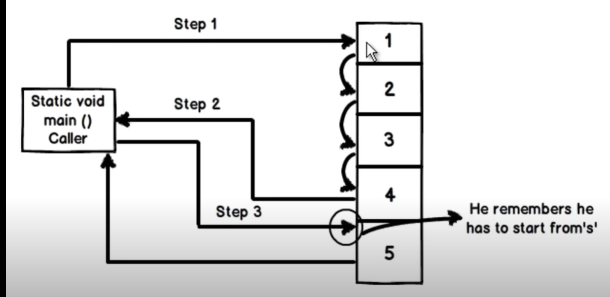

# What is the use of `Yield` keyword in C#

Yield keyword help us to perform custom and stateful iteration over a collection.

- Custom Iteration
- Stateful Iteration

## Custom and stateful Iteration

Let us first take an example of a general iteration on a collection and get all the number greater than 3.

### My understanding
When you want to perform some processing on a collection for example, filtering, some calculations, or even simple iteration, `yield` keyword helps us to achieve this without using any additional temporary collection or list.

```csharp
    class Program
    {
        // creating a list here
        static List<int> myList = new List<int>() { 1, 2, 3, 4, 5 };

        static void Main(string[] args)
        {
            // iterating here
           foreach (var item in Filter())
            {
                Console.WriteLine(item);
            }

            Console.WriteLine();
        }

        static IEnumerable<int> Filter()
        {
            List<int> temp = new List<int>();

            foreach (var item in myList)
            {
                if (item > 3)
                    temp.Add(item);
            }

            return temp;
        }

    }

```

The same iteration can be achieve using `yield` keyword as below in `Filter` function.

```csharp
    static IEnumerable<int> Filter()
    {
        foreach (var item in myList)
        {
            if (item > 3)
                yield return item;
        }
    }
```

using `yield` keyword, we need not to create another list variable, *temp list in our example*.
When we use the `yield` keyword, the control moves from the callee to caller and when control comes back to callee, it remembers where to resume from.


>Image source - YouTube

As control remembers where to resume from, this tells us that it is a stateful iteration.

In other words, when we use `yield` keyword, the control moves back and forth from caller to callee without loosing its state.

### Another Example:

The following example demonstrates a `get` accessor that is an iterator. In the example, each `yield` return statement returns an instance of a user-defined class.

```csharp 
    public static class GalaxyClass
    {
        public static void ShowGalaxies()
        {
            var theGalaxies = new Galaxies();
            foreach (Galaxy theGalaxy in theGalaxies.NextGalaxy)
            {
                Debug.WriteLine(theGalaxy.Name + " " + theGalaxy.MegaLightYears.ToString());
            }
        }

        public class Galaxies
        {

            public System.Collections.Generic.IEnumerable<Galaxy> NextGalaxy
            {
                get
                {
                    yield return new Galaxy { Name = "Tadpole", MegaLightYears = 400 };
                    yield return new Galaxy { Name = "Pinwheel", MegaLightYears = 25 };
                    yield return new Galaxy { Name = "Milky Way", MegaLightYears = 0 };
                    yield return new Galaxy { Name = "Andromeda", MegaLightYears = 3 };
                }
            }
        }

        public class Galaxy
        {
            public String Name { get; set; }
            public int MegaLightYears { get; set; }
        }
    }
```

### Questions

#### Why `yield` keyword works with `IEnumerable` only?

### References
[MSDN](https://docs.microsoft.com/en-us/dotnet/csharp/language-reference/keywords/yield)

[Code-TODO-NeedToAddGitHubLink]